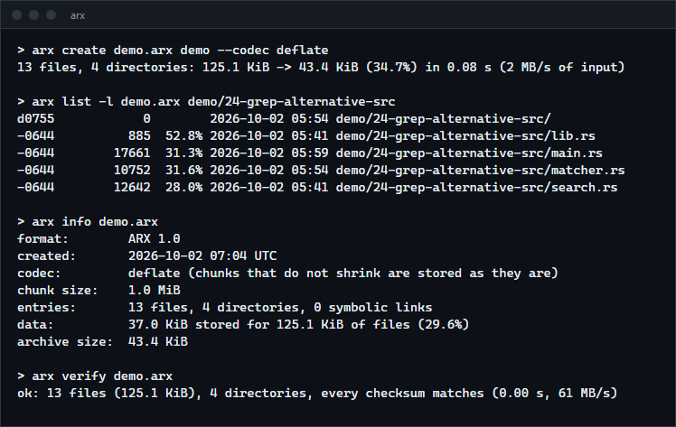
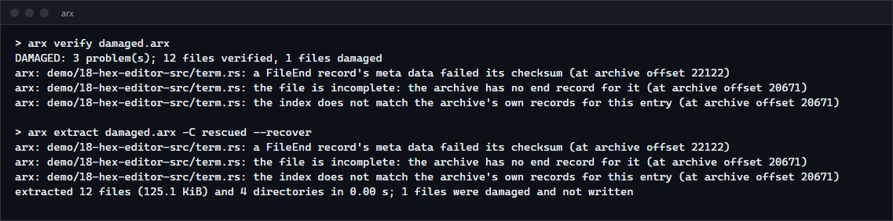
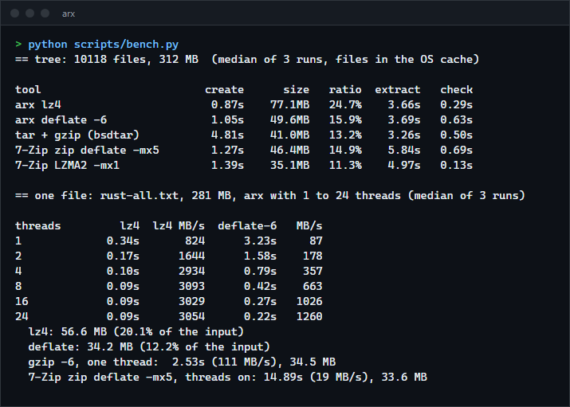
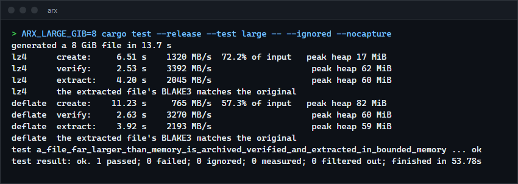

# arx

An archive format and command line tool in Rust. It compresses in parallel, checksums every chunk, reads and writes through pipes, lists and extracts single files without scanning, and tells you exactly which file is damaged and recovers the rest. For anyone who wants backups or transfers that can be verified and salvaged, and for anyone curious how such a format is designed.

**Status:** v0.1.0, working on Windows. The Unix code paths (symbolic links, permissions) compile but were not run. Not published to crates.io; build from source.



## Features

- Parallel compression on the [workpool](https://github.com/r3clusionn/thread-pool-library) thread pool: files are cut into chunks (1 MiB by default), each compressed on its own, written in order with a bounded number in flight.
- Codecs: `lz4` (fast), `deflate` (smaller, levels 1 to 9) and `none`. A chunk that would not shrink is stored as it is.
- Every byte of an archive is covered by a checksum: CRC-32 on the header, each record header, each record's meta data, each chunk's stored bytes and the footer, and BLAKE3 on each chunk's contents. A file's chunks are chained into a digest that also catches a missing, repeated, swapped or spliced chunk.
- Streaming: `create -` writes to standard output and `extract -`, `list -` and `verify -` read from standard input.
- Random access: an index at the end lets `list`, `info`, `cat` and extraction of single files or folders skip everything else.
- Damage handling: a damaged chunk costs only its own file; with `--recover`, damage that loses the position of the next record is skipped by searching for the next intact one. A truncated archive still yields every file that is complete in it.
- Safe extraction: paths that would leave the destination (`..`, absolute paths, drive letters, backslashes, device names) are refused, nothing is written through a symbolic link, and existing files are not overwritten unless asked.
- Preserves modification times (files and directories) and permissions.
- A versioned format: a reader refuses an archive from a newer major version, with a message saying so. The format is specified in [docs/FORMAT.md](docs/FORMAT.md).

## How to install

Requires a recent stable Rust (built and tested with 1.98.1) and network access to fetch the `workpool` dependency from GitHub.

```sh
git clone https://github.com/r3clusionn/archive-utility
cd archive-utility
cargo install --path .
```

This installs the `arx` binary.

## How to use

```sh
arx create backup.arx photos/ notes.txt            # lz4 by default
arx create backup.arx photos/ --codec deflate --level 9 -j 8
arx list -l backup.arx                              # permissions, size, ratio, date, path
arx info backup.arx                                 # header and totals
arx verify backup.arx                               # every checksum; exit status 1 if anything is wrong
arx extract backup.arx -C restored/                 # everything
arx extract backup.arx photos/2024 -C restored/     # one folder, found through the index
arx cat backup.arx notes.txt                        # one file to standard output
arx create - data/ | ssh host "arx extract - -C /srv"   # through a pipe, e.g. to another machine
```

| Command | What it does |
|---|---|
| `create ARCHIVE PATH...` | Make an archive (`-` for standard output). `--codec none\|lz4\|deflate`, `--level 1-9`, `--chunk-kib N`, `-j N` threads, `-q`. |
| `list ARCHIVE [PATH...]` | List entries; `-l` for details. Reads the index, or the whole stream if there is none. |
| `info ARCHIVE` | Format version, codec, chunk size, entry counts, stored and original size. |
| `extract ARCHIVE [PATH...]` | Extract into `-C DIR`. `--force` overwrites, `--skip-existing` leaves existing files, `--recover` searches past damage. |
| `verify ARCHIVE` | Check everything, always searching past damage so that all problems are listed. |
| `cat ARCHIVE PATH` | Write one file to standard output. |

Exit status: 0 for success, 1 if a problem was found (damage, a refused path, an existing file), 2 for a usage or I/O error.

### When an archive is damaged



`verify` and `extract` name the file and the offset. Files that verified are extracted; a file that failed is not left behind half written.

## How it works

- **Records, not a blob.** After a 32 byte header the archive is a stream of records: `FileBegin`, one `Chunk` per chunk, `FileEnd`, plus `Dir` and `Symlink`. Each record starts with a marker and a header with its own CRC, and each file's records carry its path and metadata. That is what lets the archive be written and read through a pipe, and read from the front when the index is missing.
- **An index at the end** lists every entry with the offset of its first record, and a fixed size footer points at the index. Random access reads the footer, then the index, then seeks.
- **Parallelism.** The writer reads a chunk, hands it to the pool (which hashes and compresses it), and queues the result. Results are written in the order the chunks were read, and at most about two chunks per thread are in flight, so memory does not grow with the input. The same applies to reading: chunks are decompressed and hashed in parallel and applied in order, and small files are written to disk on pool threads.
- **The archive does not depend on the thread count.** The same input and settings give the same bytes after the header (the creation time is in the header), whatever `-j` is.
- **Chunk digests are chained.** A file's end record holds a BLAKE3 hash of its chunk digests in order. A chunk that is valid on its own but belongs somewhere else (a chunk from another version of the file spliced in, dropped, repeated or reordered) changes the chain.
- **Recovery.** If a record header is damaged, the reader cannot know where the next record starts. It scans forward for the marker `ARXR` followed by a header whose CRC is valid, and carries on. A record whose meta is damaged but whose header is intact has a known size and is stepped over.

## Measurements

Release build on an Intel Core i9-14900KF (24 logical CPUs), Windows 11, Rust 1.98.1. Medians of 3 runs, files already in the OS cache. Compared with the `tar` that ships with Windows (bsdtar, one thread) piped through gzip, and with 7-Zip 23.01 (threads on). `scripts/bench.py` reproduces the table.



The tree is the cargo registry sources on this machine: 10,118 files in 3,222 directories, 312 MB.

| Tool | Create | Size | Extract | Check |
|---|---|---|---|---|
| arx lz4 | 0.87 s | 24.7% | 3.66 s | 0.29 s |
| arx deflate, level 6 | 1.05 s | 15.9% | 3.69 s | 0.63 s |
| tar + gzip (bsdtar) | 4.81 s | 13.2% | 3.26 s | 0.50 s |
| 7-Zip zip, deflate -mx5 | 1.27 s | 14.9% | 5.84 s | 0.69 s |
| 7-Zip LZMA2 -mx1 | 1.39 s | 11.3% | 4.97 s | 0.13 s |

- **Creating** is about 5 times faster than `tar | gzip` (0.87 and 1.05 s against 4.81 s) and a little faster than 7-Zip, because chunks compress in parallel.
- **Ratio** is where `arx` gives up something. Each chunk (at most 1 MiB, and never more than one file) is compressed alone, so there is no shared dictionary across the many small files, and the deflate encoder is a pure Rust one. On this tree `tar | gzip` is 13.2% against 15.9%. On one large file the gap is gone: 34.2 MB for `arx deflate` against 34.5 MB for `gzip -6`.
- **Extracting** is limited by creating 10,118 files and 3,222 directories on NTFS, not by decompression: `arx verify`, which decompresses and hashes everything, takes 0.29 s. A Rust program that does nothing but create the same files with `std::fs` takes 2.3 s on one thread and 1.95 s on 24. Python, on the same machine, did it in 0.99 s on 24 threads, and I did not find out why the Rust version scales less well. `arx` extracts in 3.7 s, about 1.7 s above the Rust floor and 12 percent slower than bsdtar (3.26 s).
- **One large file** (every `.rs` file of the tree joined, 281 MB): `deflate` goes from 3.23 s on one thread to 0.22 s on 24 (87 to 1,260 MB/s), against 2.53 s for `gzip -6`. `lz4` reaches about 3 GB/s at 8 threads and then stops improving, which looks like the single reading thread and not compression. 7-Zip's zip format cannot split a single file across threads, and its `-mx5` deflate took 14.9 s.

### Files larger than memory

An 8 GiB file (alternating compressible and random 1 MiB blocks), measured with a counting allocator (`tests/large.rs`, run with `--ignored`):



Peak heap stayed between 17 and 82 MiB for all three operations in both codecs, and the extracted file's BLAKE3 hash matches the original.

## Verification

- `cargo test --release` runs 62 tests (22 unit, 8 command line, 10 corruption, 11 forged-archive, 11 round-trip) and the 8 GiB test above on request.
- **Every single bit flip is detected.** The corruption suite flips each bit of a small archive in turn, for each codec (54,552, 43,080 and 36,656 bits: 134,288 flips) and requires that reading the archive reports a problem every time, and that no file accepted as good differs from the original.
- Truncation at every length is detected, and every file that is complete before the cut is still recovered. Random bursts of damage (900 of them), missing, repeated and swapped chunks, a damaged index or footer, and archives with random pieces inserted, removed or repeated never produce wrong data and never panic or hang.
- **Forged archives.** `tests/forged.rs` builds archives by hand that are wrong in exactly one way while every checksum is right (a chunk whose data does not match its digest, chunks out of order, a file digest from other data, a chunk spliced in from another version, a lying index, sizes that do not add up, a chunk claiming more than the chunk size) and checks that each is caught.
- **Mutation checks.** I disabled each check in the code in turn (the payload CRC, the meta CRC, the footer CRC, the chunk digest, the file digest chain, the chunk order check, the index comparison, the size check, the chunk size limit, the backslash and colon rules for paths, the replacement of a symbolic link) and confirmed that a test fails. At first several survived: the file digest, the chunk order, the chunk digest and the index comparison are redundant with each other for accidental damage, so removing one left the suite green. The forged archive tests were added to pin each one separately. Two path rules (a leading `/` and `..`) still survive, because another rule also rejects the same paths.
- **Problems found along the way.** The bit flip test showed that a flipped bit in the unused padding at the end of a deflate stream decompresses to the same bytes, so a hash of the uncompressed data cannot see it; every chunk now also carries a CRC-32 of its stored bytes. Directory modification times were not restored on Windows (a directory needs backup semantics to be opened). Reviewing the code found that `--force` would have written through a symbolic link at a file's path; it now replaces the link, and a test checks that the link's target stays untouched.
- Streaming is tested through real pipes, and with a reader that returns a few bytes at a time.

## Limits

- Checksums find accidental damage. They do not authenticate: someone who edits an archive can recompute them. There is no encryption and no signature; sign the archive separately if that matters.
- An archive is written once. There is no append or update.
- Files are compressed separately, with no dictionary shared across files, so many small files compress worse than with `tar | gzip` or a solid 7z.
- Only modification time and permission bits are stored: no owners, extended attributes or ACLs.
- Symbolic links are stored on Unix and skipped, with a warning, on Windows. That code, and permission handling on Unix, compiles for Linux but was not run.
- The `extract` of a single file by path matches whole path components (`photos/2024` matches `photos/2024/a.jpg`, not `photos/2024-old`).
- `cat` writes a file's bytes as it reads them, so a damaged file is reported with exit status 1 after part of it has already been written.

## License

MIT (see `LICENSE`).
